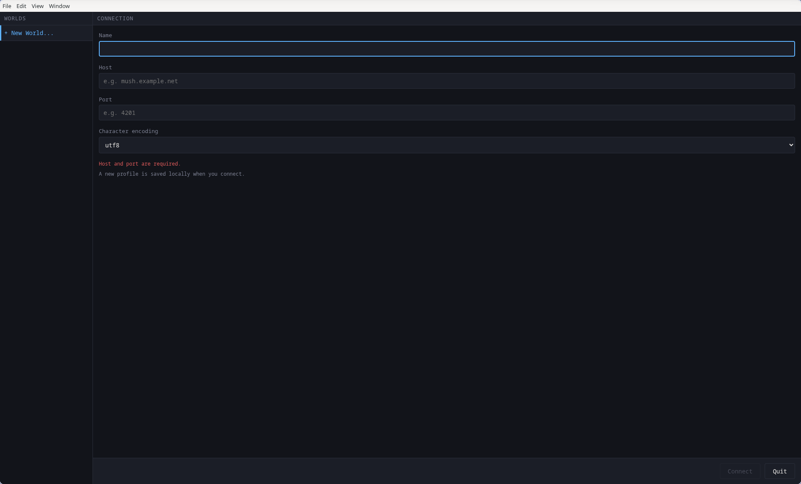
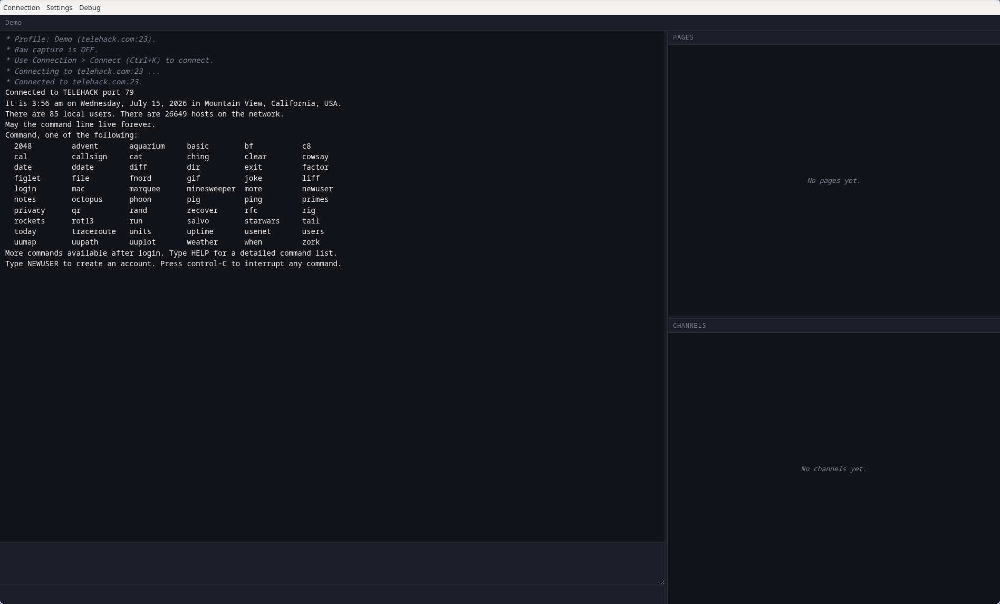

# MOO-SH

A desktop MU*/MUSH/MUD client with a Discord-like multi-window layout.

## What it is

MOO-SH is a native Electron client for telnet-based MU*, MUSH, and MUD servers. It grew out of wanting a real Linux-native alternative to Wine-wrapped legacy clients for tabletop-style MUSH roleplay, but there's nothing MUSH-specific about it under the hood — it works with any server that speaks plain telnet.

## Features

- Two-column feed: a main scrollback on the left, and a right column with tabbed **Pages** (per-correspondent private messages) and **Channels** (per-channel chat) panels.
- Per-key scrollback history that survives closing and reopening a tab.
- ANSI color support, including 16-color, 256-color, and truecolor.
- Clickable links (http/https only); image URLs (png/jpg/gif/webp/bmp) render as inline previews in the main scrollback.
- Desktop notifications and per-channel/per-page sound notifications, each with its own mute toggle.
- Multi-world, multi-login connection profiles, managed entirely in-app.
- Optional TLS for worlds that offer a secure port, with strict certificate validation by default.
- Auto-reconnect (30s retry) on a dropped or failed connection.

## Screenshots



*The Connect window on first launch — pick or create a world.*



*Connected to Telehack, a public telnet demo server — the main scrollback on the left, Pages and Channels panels on the right.*

## Install

### Windows

Download the `.exe` from the [GitHub Releases](../../releases) page and run it.

The installer is **unsigned**, so Windows SmartScreen will show a warning when you run it. Click "More info" then "Run anyway" to proceed. Windows builds are produced automatically by CI but have not yet been tested by a human — use with that in mind.

### Linux

- **.deb** (Debian/Ubuntu): installs and registers a desktop icon automatically. Install with `sudo dpkg -i moo-sh_*.deb` or by double-clicking the file.
- **AppImage**: a portable single-file build. Make it executable and run it directly:

  ```
  chmod +x MOO-SH-*.AppImage
  ./MOO-SH-*.AppImage
  ```

  Note that the AppImage does **not** register a desktop menu icon on its own — you'll need [AppImageLauncher](https://github.com/TheAssassin/AppImageLauncher) or `appimaged` for that.

## Requirements & running from source

MOO-SH runs on [Node.js](https://nodejs.org), a JavaScript runtime, plus npm, the package manager that comes bundled with it. You'll need both installed to run MOO-SH from source — if this is your first time using npm, that's fine, the steps below don't assume any prior experience.

If you're not sure whether you already have them, open a terminal and run:

```
node --version
npm --version
```

If both print a version number, you're already set and can skip to the OS-specific steps below. If you get a "command not found" error, install Node.js first — grab the **LTS** installer from https://nodejs.org, which installs npm alongside it automatically.

Once Node.js and npm are installed, running MOO-SH from source comes down to two commands, run from inside the project folder:

- **`npm install`** — downloads all of the project's dependencies (including Electron itself) into a local `node_modules/` folder. This needs an internet connection and can take a few minutes the first time. You only need to re-run it after pulling code changes that touch dependencies.
- **`npm start`** — actually launches the MOO-SH app window. Under the hood this runs `electron .`.

There's also a test suite, if you want to check everything's working:

```
npm test
```

### Linux

This is the platform MOO-SH is developed and tested on.

1. Install Node.js, npm, and Git through your distro's package manager, for example:
   - Arch: `sudo pacman -S nodejs npm git`
   - Debian/Ubuntu: `sudo apt install nodejs npm git`

   (Or install Node.js from the https://nodejs.org installer instead, if you'd rather not rely on your distro's package.)
2. Clone the repo and step into it:
   ```
   git clone https://github.com/ull-spec/moo-sh.git
   cd moo-sh
   ```
3. Install dependencies and start the app:
   ```
   npm install
   npm start
   ```

### macOS

Nobody has built or tested MOO-SH on macOS yet. The codebase has no native or platform-specific code in it, so there's good reason to expect it works, but treat this as genuinely unverified until someone confirms it.

1. Install Node.js: download the installer from https://nodejs.org, or if you use Homebrew, `brew install node`.
2. Install Git: run `xcode-select --install` to get the Xcode Command Line Tools (which include Git), or `brew install git`.
3. Clone the repo and step into it:
   ```
   git clone https://github.com/ull-spec/moo-sh.git
   cd moo-sh
   ```
4. Install dependencies and start the app:
   ```
   npm install
   npm start
   ```

### Windows

As with the prebuilt `.exe`, running from source on Windows hasn't been tested by a human — CI builds it, but nobody's confirmed the app actually runs correctly there.

1. Install [Node.js](https://nodejs.org) (the LTS installer) and [Git](https://git-scm.com).
2. Clone the repo and step into it:
   ```
   git clone https://github.com/ull-spec/moo-sh.git
   cd moo-sh
   ```
3. Install dependencies and start the app:
   ```
   npm install
   npm start
   ```

## Adding a world

On first launch the Connect window is empty. Click **+ New World...** and enter your server's host, port, and charset (default is latin1). You can add multiple logins per world.

Profiles are saved locally as plaintext JSON in the app's per-user data directory, so they never leave your machine. The folder is named after the app — `MOO-SH` for an installed build, or `moo-sh` when running from source — inside your OS's standard per-application data location:

- **Linux:** `~/.config/MOO-SH/profiles/`
- **macOS:** `~/Library/Application Support/MOO-SH/profiles/`
- **Windows:** `%APPDATA%\MOO-SH\profiles\`

(Substitute `moo-sh` for `MOO-SH` in those paths if you're running from source. And if you ran an older development build that stored profiles in the repo's `config/profiles/` directory, they're copied into this location automatically on first launch.) No example or template profiles are shipped with the app — you set up your own from scratch.

## Platform support

MOO-SH is developed and tested on Linux only (Arch, Wayland). The codebase is plain Electron with no platform-specific code, so cross-platform support is expected to work, but the other platforms haven't been confirmed:

- **Windows:** `.exe` installers are produced automatically by CI, but no human has run one yet. Treat them as untested.
- **macOS:** not built or tested at all — there's no macOS CI build, and nobody has run it from source. See the source-install steps above if you want to try.

Don't assume Windows or macOS works until someone confirms it.

## Security & privacy

Read this before connecting to anything you care about.

- TLS is supported per-profile (implicit TLS on a dedicated secure port), but it's opt-in — a world you add without enabling it connects over **plaintext telnet**. Over plaintext, anyone able to observe your network traffic can read your entire session, including any password sent at login. Only connect over plaintext to servers/networks you trust, and prefer TLS when the server offers it.
- Auto-login commands may contain your password. These are stored in plaintext in local per-world profile JSON files. Those files are gitignored and never leave your machine, but they are not encrypted at rest — anyone with access to your filesystem can read them.
- Raw capture logging, when enabled, writes session text to disk under `captures/`.

## License

ISC. See [LICENSE](LICENSE). Copyright (c) 2026 ull-spec.
